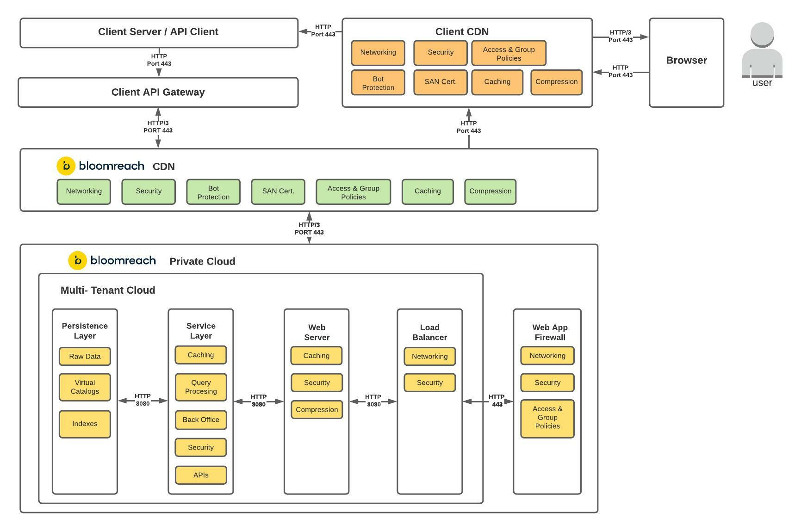
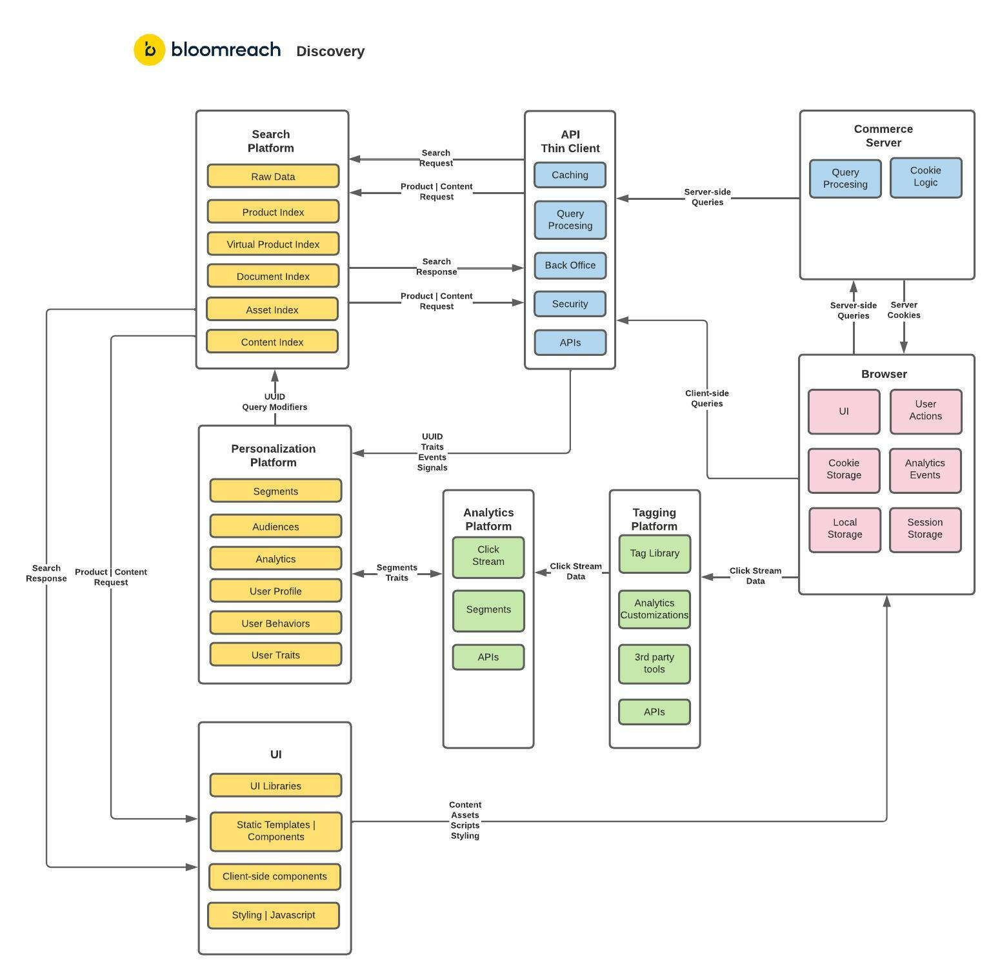

# SaaS Commerce Experience Cloud

The SaaS Commerce Experience platform is powered by these Bloomreach Solutions

* Content
* Discovery
* Engagement

## Discovery SaaS Cloud Architecture

### Multi-tenant private cloud hosting

Keeps individual client data, integrations and indices scalable, performant and secure

### Secure Network Connectivity

Ensures that "bad actors" cannot gain access to the system, while ensuring that authorized connections and systems can readily access the indices, data and services.

### Distributed Microservices

Utilize cloud based services and distributed infrastructure to off-load and handle the personalization and indexing services, to ensure that requests to the search indices can be highly  responsive & performant.

### Solution Context

The Solution Context will provide an incremental layer of detail and granularity, as it provides a detailed view of how the systems & solutions will interact

