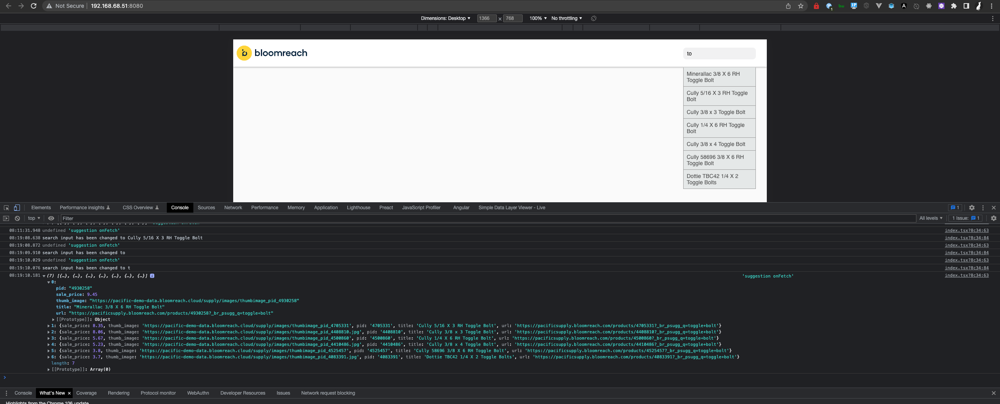

# Bloomreach Discovery React Widget Demo

| Dependency                                                                                                 | Version  |                                                         Notes |
|:-----------------------------------------------------------------------------------------------------------|:--------:|--------------------------------------------------------------:|
|                     |   v2.0   | API Client                                    Version @latest |
|                                                        | v10.11.2 |                                               Version @latest |
|     |  v16.13  |                                       [ ] TODO Upgrade to LTS |
|     |  v4.8.3  |                                               Version @latest |
|       |  v8.18   |                                       [ ] TODO Upgrade to LTS |
|      |  v3.2.2  |                                               Version @latest |
|  | v2.75.5  |         NOTE - Upgrade to LTS will introduce breaking changes |

## Overview

---

To assist developers with their implementation, there is a basic example of a client-side implementation using React / Preact that can be built / loaded locally.

## Installation

---

### Local Installation via SDK

1. Download and Install the SDK `npm -i -d @bloomreach/discovery/sdk`
2. Navigate to package located at `packages/frontend/react-custom`
3. Build package using command `yarn dev`

### React / Preact package | Library

1. Download / install the package from npm `npm -i -d @bloomreach/discovery-sdk-react-frontend`
2. See the README.md for the individual components with respect to their individual configuration & use

## Roadmap

1. Create a reusable client-side component library that can be imported, configured and styled to conform to the brand / business needs
2. Create a Storybook implementation to support feature review and developer implementation.
3. Create server-side component library
   .
